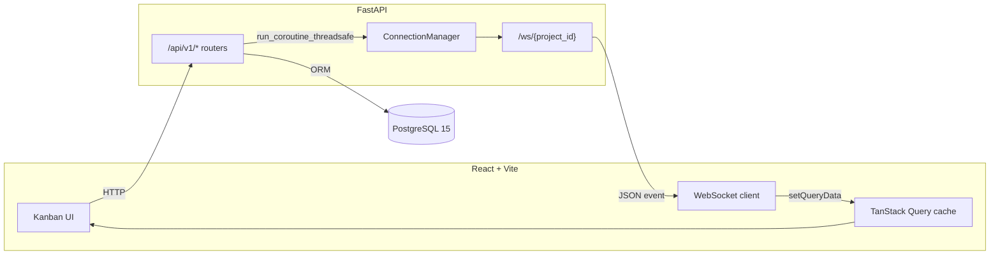
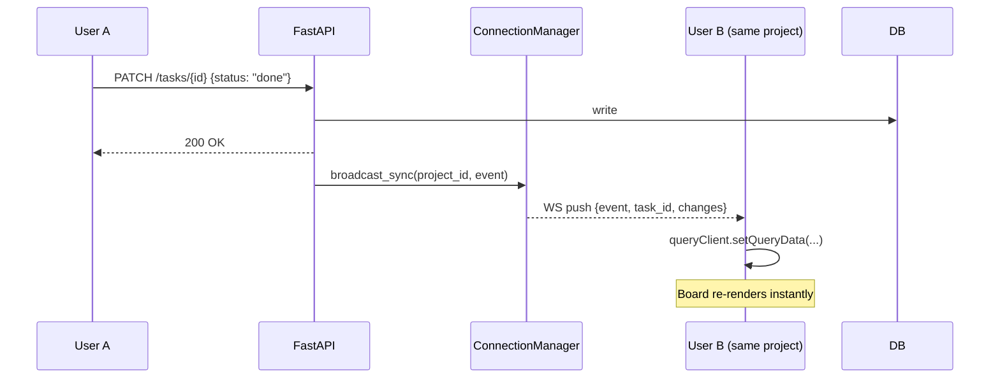

# TaskFlow

[](https://github.com/your-username/taskflow/actions/workflows/ci.yml)
[](https://taskflow-production-fa5f.up.railway.app)
[](https://frontend-flame-nine-17.vercel.app)

**Live demo:** https://frontend-flame-nine-17.vercel.app

Real-time collaborative task manager. Full-stack portfolio project built to demonstrate production engineering patterns: REST API design, WebSocket event broadcasting, JWT auth, multi-tenant data isolation, containerisation, and CI/CD.

## What it does

TaskFlow lets teams manage work across shared workspaces. Users create workspaces, invite members by email, organize work into projects, and track tasks on a Kanban board. Changes made by any collaborator — task creation, status updates, comments — appear on every connected client's board in real time without a page refresh.

## Tech stack

| Layer | Technology |
|---|---|
| Backend | FastAPI, SQLAlchemy 2, Alembic, Pydantic v2 |
| Database | PostgreSQL 15 |
| Real-time | WebSockets (native FastAPI) |
| Auth | JWT (python-jose) + bcrypt |
| Frontend | React 18, Vite, TanStack Query, Zustand, Tailwind CSS |
| Infra | Docker, Docker Compose |
| CI | GitHub Actions |
| Deploy | Railway (backend + DB), Vercel (frontend) |

## Architecture



The backend runs sync FastAPI route handlers in a thread pool. Broadcasting to WebSocket clients from a sync context requires scheduling onto the event loop explicitly via `asyncio.run_coroutine_threadsafe` — a subtlety that naive implementations get wrong (and silently fail). The loop is captured at startup and held by the `ConnectionManager`.

## Real-time flow

When a user updates a task:



No polling. The receiving client patches its local TanStack Query cache directly — no network round-trip needed.

## Local development

Requires Docker Desktop.

```bash
git clone https://github.com/your-username/taskflow.git
cd taskflow
docker compose up --build
```

- Frontend: http://localhost:5173
- API: http://localhost:8000
- Swagger: http://localhost:8000/docs

The compose file runs `alembic upgrade head` automatically before starting the API server, so no manual migration step is needed.

## API reference

**Auth**
```
POST /api/v1/auth/register
POST /api/v1/auth/login
GET  /api/v1/auth/me
```

**Workspaces**
```
GET    /api/v1/workspaces/
POST   /api/v1/workspaces/
GET    /api/v1/workspaces/{id}
POST   /api/v1/workspaces/{id}/members
DELETE /api/v1/workspaces/{id}/members/{uid}
```

**Projects**
```
GET    /api/v1/workspaces/{wid}/projects/
POST   /api/v1/workspaces/{wid}/projects/
PATCH  /api/v1/workspaces/{wid}/projects/{id}
DELETE /api/v1/workspaces/{wid}/projects/{id}
```

**Tasks**
```
GET    /api/v1/projects/{pid}/tasks/   ?status=&priority=&assignee_id=
POST   /api/v1/projects/{pid}/tasks/
GET    /api/v1/projects/{pid}/tasks/{id}
PATCH  /api/v1/projects/{pid}/tasks/{id}
DELETE /api/v1/projects/{pid}/tasks/{id}
```

**Comments**
```
GET    /api/v1/tasks/{tid}/comments/
POST   /api/v1/tasks/{tid}/comments/
PATCH  /api/v1/tasks/{tid}/comments/{id}
DELETE /api/v1/tasks/{tid}/comments/{id}
```

**WebSocket**
```
WS /ws/{project_id}?token=<jwt>
```

Event payloads:
```json
{ "event": "task.created",  "task": { ...TaskOut } }
{ "event": "task.updated",  "task_id": "...", "changes": { ... } }
{ "event": "task.deleted",  "task_id": "..." }
{ "event": "comment.added", "comment": { ...CommentOut } }
```

## Tests

```bash
cd backend
pytest tests/ -v
```

Uses per-test transaction rollback — each test gets a clean database state with no teardown overhead.

## Deployment

Backend is on Railway with a `railway.json` that runs `alembic upgrade head` as a release command before every deploy. Frontend is on Vercel with a `vercel.json` that handles SPA client-side routing rewrites.

To self-host:

```bash
# Backend (Railway)
railway init
railway add --database postgresql
railway variables set JWT_SECRET=<secret>
railway variables set CORS_ORIGINS=https://your-frontend.vercel.app
railway up ./backend

# Frontend (Vercel)
cd frontend
vercel --prod
# Set VITE_API_URL=https://your-railway-backend.up.railway.app in Vercel env settings
```

## Project structure

```
taskflow/
├── .github/workflows/ci.yml
├── docker-compose.yml
├── backend/
│   ├── Dockerfile
│   ├── railway.json
│   ├── Procfile
│   ├── requirements.txt
│   ├── alembic/
│   │   └── versions/0001_initial_schema.py
│   ├── app/
│   │   ├── main.py
│   │   ├── core/        config, database, security
│   │   ├── models/      User, Workspace, Project, Task, Comment
│   │   ├── schemas/     Pydantic v2 request/response models
│   │   ├── routers/     auth, workspaces, projects, tasks, comments
│   │   └── ws/          ConnectionManager, WebSocket endpoint
│   └── tests/
│       ├── conftest.py  transaction-rollback fixture
│       └── test_api.py
└── frontend/
    ├── vercel.json
    ├── vite.config.js
    └── src/
        ├── App.jsx          auth hydration, route guards
        ├── api/             axios client, per-module API functions
        ├── hooks/           useAuthStore (Zustand), useWebSocket
        ├── components/      TaskCard, KanbanColumn, CommentThread
        └── pages/           Login, Register, WorkspaceList,
                             WorkspaceDetail, KanbanBoard, TaskDetail
```
