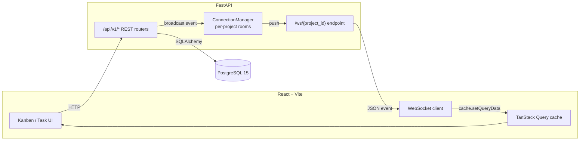
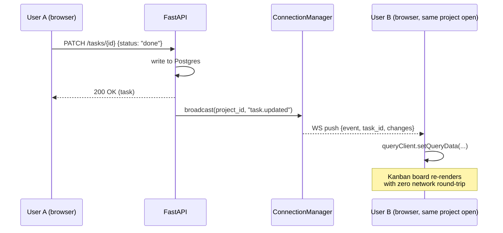

# TaskFlow

[](https://github.com/your-username/taskflow/actions/workflows/ci.yml)
[](https://railway.app)
[](https://vercel.com)

**Live demo:** `https://your-app.vercel.app` _(replace after deploying — see [Deployment](#deployment))_

A real-time collaborative task manager. Full-stack portfolio project demonstrating production-grade patterns: REST API, WebSockets, JWT auth, containerisation, and CI/CD.

## Features

- 🔐 JWT auth with bcrypt password hashing
- 🏢 Multi-tenant workspaces with owner/member roles and email invites
- 📋 Projects → Kanban-style task boards (To Do / In Progress / Done)
- ⚡ Real-time sync — task and comment changes broadcast instantly over WebSockets to every connected collaborator, no polling
- 💬 Threaded comments per task with author-only edit and author/owner delete
- 🐳 One-command local dev via Docker Compose
- ✅ CI on every push: lint (ruff + eslint), Postgres-backed integration tests, Docker image builds
- 🚀 Auto-deploy to Railway on merge to `main`

## Tech Stack

| Layer | Technology |
|---|---|
| Backend | FastAPI, SQLAlchemy 2, Alembic, Pydantic v2 |
| Database | PostgreSQL 15 |
| Real-time | WebSockets (native FastAPI) |
| Auth | JWT (python-jose) + bcrypt |
| Frontend | React 18, Vite, TanStack Query, Zustand, Tailwind CSS |
| Infra | Docker, docker-compose |
| CI | GitHub Actions |
| Deploy | Railway (backend + DB) / Vercel (frontend) |

## Architecture



**Real-time flow:** when any user creates, updates, or deletes a task, the API broadcasts a typed event (`task.created` / `task.updated` / `task.deleted` / `comment.added`) to all WebSocket connections in that project's room. The React client patches TanStack Query's cache directly — no full refetch needed.




## Local Development

### Prerequisites
- Docker + Docker Compose

### Start everything

```bash
git clone https://github.com/your-username/taskflow.git
cd taskflow
docker compose up --build
```

- API: http://localhost:8000
- Swagger docs: http://localhost:8000/docs
- Frontend: http://localhost:5173

### Run without Docker

```bash
# 1. Start Postgres
docker compose up db -d

# 2. Backend
cd backend
python -m venv .venv && source .venv/bin/activate
pip install -r requirements.txt
alembic upgrade head
uvicorn app.main:app --reload

# 3. Frontend (new terminal)
cd frontend
npm install
npm run dev
```

## API Reference

### Auth
| Method | Path | Description |
|---|---|---|
| POST | `/api/v1/auth/register` | Register + receive JWT |
| POST | `/api/v1/auth/login` | Login + receive JWT |
| GET | `/api/v1/auth/me` | Current user |

### Workspaces
| Method | Path | Description |
|---|---|---|
| GET | `/api/v1/workspaces/` | List my workspaces |
| POST | `/api/v1/workspaces/` | Create workspace |
| GET | `/api/v1/workspaces/{id}` | Workspace detail + members |
| POST | `/api/v1/workspaces/{id}/members` | Invite member by email |
| DELETE | `/api/v1/workspaces/{id}/members/{uid}` | Remove member |

### Projects
| Method | Path | Description |
|---|---|---|
| GET | `/api/v1/workspaces/{wid}/projects/` | List projects |
| POST | `/api/v1/workspaces/{wid}/projects/` | Create project |
| PATCH | `/api/v1/workspaces/{wid}/projects/{id}` | Update project |
| DELETE | `/api/v1/workspaces/{wid}/projects/{id}` | Archive project |

### Tasks
| Method | Path | Description |
|---|---|---|
| GET | `/api/v1/projects/{pid}/tasks/` | List tasks (filterable by status/priority/assignee) |
| POST | `/api/v1/projects/{pid}/tasks/` | Create task |
| GET | `/api/v1/projects/{pid}/tasks/{id}` | Get task |
| PATCH | `/api/v1/projects/{pid}/tasks/{id}` | Update task |
| DELETE | `/api/v1/projects/{pid}/tasks/{id}` | Delete task |

### Comments
| Method | Path | Description |
|---|---|---|
| GET | `/api/v1/tasks/{tid}/comments/` | List comments |
| POST | `/api/v1/tasks/{tid}/comments/` | Add comment |
| PATCH | `/api/v1/tasks/{tid}/comments/{id}` | Edit comment (author only) |
| DELETE | `/api/v1/tasks/{tid}/comments/{id}` | Delete comment (author or workspace owner) |

### WebSocket
```
WS /ws/{project_id}?token=<jwt>
```
Events received:
```json
{ "event": "task.created", "task": { ...TaskOut } }
{ "event": "task.updated", "task_id": "...", "changes": { ... } }
{ "event": "task.deleted", "task_id": "..." }
{ "event": "comment.added", "comment": { ...CommentOut } }
```

## Tests

```bash
cd backend

# requires a running postgres at TEST_DATABASE_URL
pytest tests/ -v
```

Tests use a per-test transaction rollback — no data bleeds between tests.

## Deployment

### Railway (backend + DB)

The repo includes `backend/railway.json` (release command runs `alembic upgrade head` automatically before every deploy) and a `Procfile` fallback.

```bash
npm i -g @railway/cli
railway login

cd taskflow
railway init
railway add --database postgresql

railway variables set JWT_SECRET=$(openssl rand -hex 32)
railway variables set CORS_ORIGINS=https://your-frontend.vercel.app

railway up
```

**Auto-deploy on push to `main`:** generate a deploy hook URL in Railway's project settings → add it as a GitHub repo secret named `RAILWAY_DEPLOY_HOOK`. The CI workflow (`.github/workflows/ci.yml`) calls it automatically after backend/frontend tests and Docker builds pass.

### Vercel (frontend)

```bash
cd frontend
npm i -g vercel
vercel --prod
# Set VITE_API_URL=https://your-railway-backend.railway.app in Vercel project settings
```

`frontend/vercel.json` handles SPA rewrites so client-side routes (e.g. `/projects/:id`) don't 404 on refresh.

## Project Structure

```
taskflow/
├── .github/workflows/ci.yml
├── docker-compose.yml
├── backend/
│   ├── Dockerfile
│   ├── railway.json
│   ├── Procfile
│   ├── .env.example
│   ├── alembic.ini
│   ├── requirements.txt
│   ├── alembic/
│   │   ├── env.py
│   │   └── versions/0001_initial_schema.py
│   ├── app/
│   │   ├── main.py
│   │   ├── core/       config, database, security
│   │   ├── models/     User, Workspace, Project, Task, Comment
│   │   ├── schemas/    Pydantic schemas
│   │   ├── routers/    auth, workspaces, projects, tasks, comments
│   │   └── ws/         manager, router
│   └── tests/
│       ├── conftest.py
│       └── test_api.py
└── frontend/
    ├── Dockerfile
    ├── vercel.json
    ├── .env.example
    ├── package.json
    ├── vite.config.js
    └── src/
        ├── main.jsx
        ├── App.jsx
        ├── api/        client.js
        ├── hooks/      useAuthStore.js, useWebSocket.js
        ├── components/ index.jsx, CommentThread.jsx
        └── pages/      Login, Register, WorkspaceList, WorkspaceDetail,
                        KanbanBoard, TaskDetail
```
